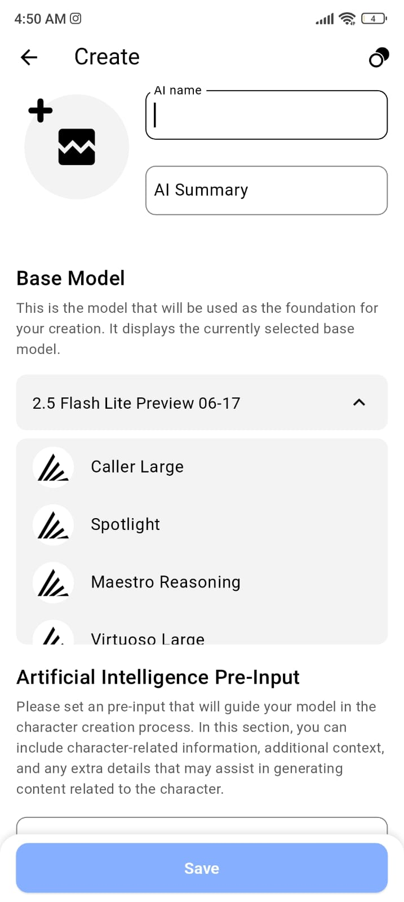
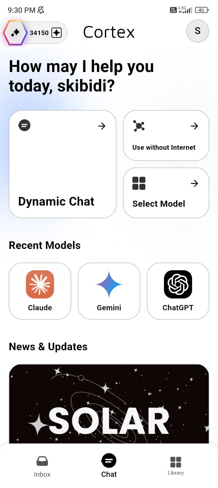
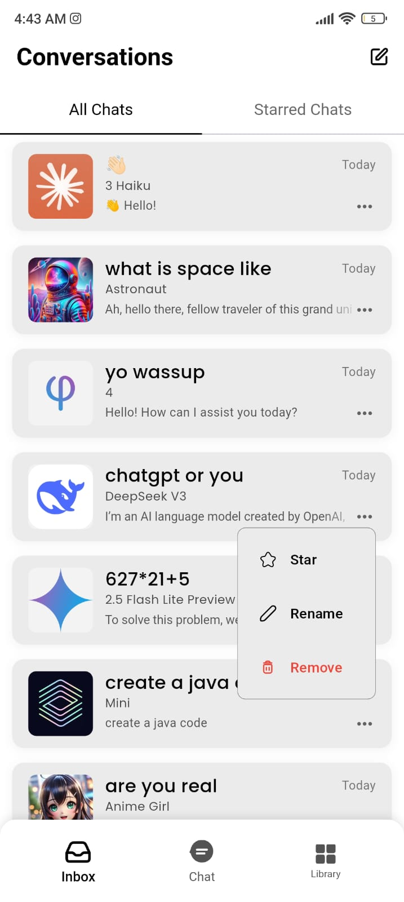
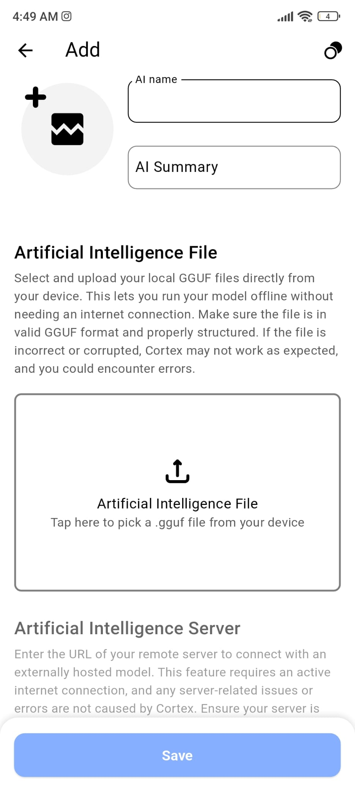
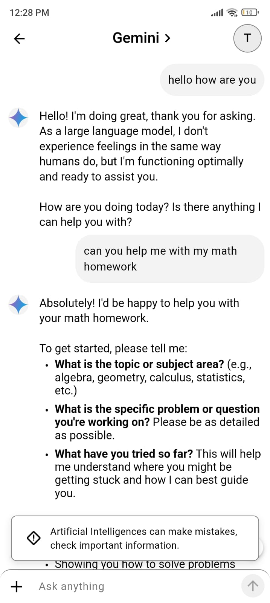

<div align="center">
  <i>"Bütün ümidim gençliktir."</i><br>
  <b>— Mustafa Kemal Atatürk</b>
</div>

<br>

<div align="center">

  <h1>C O R T E X</h1>
  <h3>C O R E &nbsp; O F &nbsp; A R T I F I C I A L &nbsp; I N T E L L I G E N C E</h3>
  <p>
    Privacy-first, hyper-personalized, and always available AI—right in your pocket.
    <br/>
    <strong>Step into the future of AI, on your terms.</strong>
  </p>

  <p>
    <a href="https://github.com/VertexCorporation/Cortex/issues">Report Bug</a> · 
    <a href="https://github.com/VertexCorporation/Cortex/issues">Request Feature</a> ·
    <a href="https://vertexishere.com/tr/indir">Download App</a>
  </p>

  <p>
    <a href="https://github.com/VertexCorporation/Cortex/blob/main/LICENSE">
        
    </a>
    <a href="https://github.com/VertexCorporation/Cortex/stargazers">
        
    </a>
    <a href="https://github.com/VertexCorporation/Cortex/network/members">
        
    </a>
    <a href="https://play.google.com/store/apps/details?id=com.vertex.cortex">
        
    </a>
  </p>
</div>

---

## Welcome to Cortex

**Cortex** redefines your relationship with artificial intelligence. It's a revolutionary mobile application that places the power of cutting-edge AI directly in your hands, designed with three core principles: **Privacy, Personalization, and Performance.** Whether you're offline on a remote trail or connected to the cloud, Cortex ensures your AI companion is always there for you.

Control your data, customize your experience, and access the pinnacle of AI from anywhere.

###  App Showcase

> *Experience the redesigned interface and groundbreaking features in the latest update.*

|                                                                                          |                                                                                    |                                                                                      |                                                     |
|:----------------------------------------------------------------------------------------:|:----------------------------------------------------------------------------------:|:------------------------------------------------------------------------------------:|:---------------------------------------------------:|
|                                       |                                 |                                   |  |
|                                     **Intelligent Hub**                                    |                                  **Flow Mode**                                  |                                   **Personal AI Lab**                                   |                  **Advanced Tools**                   |
|                                       |                                 |                                   |  |
|                                     **Custom Themes**                                     |                                  **Voice Chat**                                  |                                   **Offline Engine**                                   |                  **Analytics**                   |

*(Note: The showcase represents the latest features including live data integration and performance improvements.)*

---

##  Table of Contents

- [Why Choose Cortex?](#-why-choose-cortex)
- [Key Features](#-key-features)
- [How It Works](#-how-it-works)
  - [Offline Mode: The Privacy Fortress](#-offline-mode-the-privacy-fortress)
  - [Online Mode: The Power of the Cloud](#-online-mode-the-power-of-the-cloud)
- [Subscription Tiers](#-subscription-tiers)
- [The Vision & Roadmap](#-the-vision--roadmap)
- [A Note on Perseverance](#-a-note-on-perseverance)
- [Technologies Used](#-technologies-used)
- [Contributing](#-contributing)
- [License](#-license)
- [Legal & Attributions](#-legal--attributions)
- [Stay Updated](#-stay-updated)

---

##  Why Choose Cortex?

-  **AI, Anywhere:** Use powerful AI with or without an internet connection. True portability.
-  **Privacy-First by Design:** Your data is yours. With offline mode, your conversations never leave your device.
-  **Unmatched Personalization:** From visual themes to creating your own AI models, make Cortex uniquely yours.
-  **Open Source & Transparent:** Built on trust and community. Our code is on GitHub for anyone to review.
-  **Sleek & Modern Interface:** Powerful features wrapped in a simple, fast, and beautiful package built with Flutter.

---

##  Key Features

- **Dual AI Modes:**
  - **Offline AI (Llama.cpp):** Run models directly on your device. 100% private, no internet needed.
  - **Online AI (Cloud-Powered):** Access state-of-the-art models like GPT-4o and Amazon Nova via our secure servers.

- ** Your Personal AI Laboratory:**
  - **Create & Upload Models:** Craft your own AI assistant from scratch or upload an existing GGUF model. Create unique characters or expert advisors with full control and no technical expertise required.
  - **Automated Safety:** To protect our community, all user-created and uploaded models are automatically reviewed against our content policies.

- ** True Customization:**
  - Go beyond light and dark mode. Personalize your interface with a rich library of themes to create an aesthetic experience that's truly yours.

- ** Interactive AI Characters:**
  - Engage with a growing roster of AI characters, each with a unique personality and purpose. Get help from a lawyer, learn with a teacher, or have fun with creative personas.

---

##  How It Works

Cortex offers two distinct modes to balance privacy and power.

###  Offline Mode: The Privacy Fortress

- **Engine:** Powered by a highly optimized `Llama.cpp` engine integrated via JNI (Java Native Interface).
- **Data Flow:** All processing happens **100% locally**. Your prompts and AI responses never leave your device, ensuring absolute privacy.
- **Safety:** To maintain a safe environment, the app periodically downloads an updated set of moderation rules from Google Firebase (when online). The safety check itself is then performed **locally on your device** without transmitting any of your private conversation data.

###  Online Mode: The Power of the Cloud

- **Gateway:** In this mode, prompts are sent to premium cloud-based AI models through **OpenRouter**, a third-party API gateway.
- **Data Flow & Safety:**
  1. Your prompt is first sent to our partners (e.g., OpenAI) for an automated safety review.
  2. If it passes, it's securely relayed through our Cloudflare infrastructure to OpenRouter, which routes it to your selected AI provider (e.g., Anthropic, Google).
- **Privacy Note:** This mode is **less privacy-focused** as your data is transmitted to external servers. We act as a secure relay and do not permanently store your conversation content. Please review the privacy policies of our partners.

---

##  Subscription Tiers

Cortex is accessible to everyone. Choose the level that fits you best.

- ** Free Tier:**
  - Explore our online models with daily usage limits. A great way to get started.

- ** Plus, Pro, & Ultra Tiers:**
  - Unlock the full potential of Cortex with higher usage limits, the ability to create and upload your own models, access to premium themes, and much more. Cancel anytime.

> For the most up-to-date pricing and feature details, please check the products section within the app.

---

##  The Vision & Roadmap

Our mission is to make **Cortex the central hub for personal artificial intelligence**. We are just getting started. Here’s a glimpse of what the future holds:

- ** Bring Your Own Key (BYOK):** Use your own API keys from various AI providers to bypass the Cortex credit system entirely.
- ** Multi-Modal AI:** Go beyond text. Generate **images, voice, and video** directly within Cortex.
- ** Train from Scratch:** An advanced feature allowing users to train new models on their own datasets.
- ** Real-Time Interaction:** Engage in seamless **voice and video conversations** with your AI companions.
- ** Autonomous AI Agents:** Deploy AI agents that can understand complex goals and perform multi-step tasks for you.
- ** Cortex for Web:** Access your personalized AI universe from any device with a web browser.

---

> ### A Note on Perseverance
>
> The journey to build Cortex has been a marathon, not a sprint. **We started this journey at just 15 years old,** pouring our passion into the project only to face a wall of resistance: **over 20 rejections from app stores, 2 account suspensions, and countless warnings.**
>
> We could have given up, but we believed in the vision: an AI that serves the user, not the other way around. This project is a testament to resilience. For every developer, creator, or dreamer facing setbacks: **don't stop.** Your persistence is your greatest asset. Keep building.

---

##  Tech Stack

- ** Frontend:** Flutter, Dart
- ** Backend & Cloud:**
  - **Runtime:** Node.js
  - **Hosting & CDN:** Google Cloud, Cloudflare
  - **Authentication & DB:** Google Firebase
- ** AI Core:**
  - **Online Gateway:** OpenRouter
  - **Offline Engine:** Llama.cpp (C and C++ with JNI Bindings)
- ** Localization:** `flutter_localizations` (using ARB files)

---

##  Getting Started

Welcome, developer! We are thrilled that you want to explore the inner workings of Cortex.

 **Important Note:** Cortex is a complex application tightly integrated with a custom backend and several third-party services. This is **not a "clone and run"** project. Significant setup and configuration on your part are required to get a local development environment running.

Follow these steps carefully to set up your own instance of Cortex.

### 1. Prerequisites

Make sure you have the following tools and versions installed on your system.

- **Flutter SDK:** `3.32.7` or newer
- **Dart SDK:** `3.8.1` or newer (comes with Flutter)
- **Java JDK:** Version 11 (`JavaVersion.VERSION_11`)
- **Android Studio:** Recommended for managing Android SDKs and emulators.
- **Android NDK:** Version `26.1.1090125` is used in this project. You can install a specific version via the Android Studio SDK Manager (`Tools > SDK Manager > SDK Tools`).
- **Git**

### 2. Environment & Service Configuration

Before you even run the app, you need to set up your own backend infrastructure. This is the most critical part of the setup.

#### Step 2.1: Firebase Project
The app heavily relies on Google Firebase for authentication, database, and safety rules.
1.  Go to the [Firebase Console](https://console.firebase.google.com/) and create a new project.
2.  Enable **Authentication** (Email/Password), **Firestore Database**, and any other services you see used in the codebase.
3.  Register a new Android app within your Firebase project.
4.  Follow the instructions to download the `google-services.json` file. You will place this in the `android/app/` directory.

#### Step 2.2: OpenRouter API Key
Online AI models are accessed via OpenRouter.
1.  Go to [OpenRouter.ai](https://openrouter.ai/) and create an account.
2.  Get your personal API key. This key will be used by your backend server.

#### Step 2.3:  Crucial Step: Your Own Backend Server
Many features (like user login, name changes, and API key management) are handled by our custom server. **You will need to replicate or replace this logic.**
1.  Review the Flutter codebase to identify all HTTP requests made to our servers.
2.  Create your own backend server (e.g., using Node.js, Python, or your preferred stack) that handles these endpoints.
3.  Your server will be responsible for securely storing user data and proxying requests to services like OpenRouter using your API key.
4.  Update the API endpoint URLs in the Flutter codebase to point to your new server.

### 3. Local Project Setup & Build

Now you can set up the project on your local machine.

1.  **Clone the Repository:**
    ```bash
    git clone https://github.com/VertexCorporation/Cortex.git
    cd Cortex
    ```

2.  **Initialize Submodules (Llama.cpp):**
    Cortex uses `llama.cpp` for its offline AI engine, included as a Git submodule. You must initialize it:
    ```bash
    git submodule update --init --recursive
    ```

3.  **Configure Android:**
  - Place the `google-services.json` file you downloaded in Step 2.1 into the `android/app/` directory.
  - **Create a Keystore:** You need to sign your app for development. Follow the official Flutter guide to [create and reference a keystore](https://docs.flutter.dev/deployment/android#create-and-reference-a-keystore). This involves creating a `key.properties` file in the `android/` directory that should **NEVER** be committed to Git.

4.  **Install Dependencies:**
    ```bash
    flutter pub get
    ```

5.  **Build and Run:**
    You should now be able to run the app. The Android Gradle build process is configured to automatically compile the `llama.cpp` engine using the NDK.
    ```bash
    flutter run
    ```

### 4. Automatic Translation Setup (Optional)

This project uses a semi-automated script to translate new localization keys into all supported languages using the Google Translate API. This is an optional but highly recommended step if you plan to contribute to the app's localization.

Follow these one-time setup steps to enable the `translate` command on your local machine.

#### Step 4.1: Prerequisites

- **Python 3:** Ensure you have a modern version of Python 3 installed. You can check with `python3 --version`.
- **Google Cloud API Key:** You need an active API Key from a Google Cloud project with the **"Cloud Translation API"** enabled. This project must have a billing account attached. The API has a generous free tier, but a billing account is required for activation.

#### Step 4.2: Install Python Library

Open your standard system terminal and run the following command to install the Google Translate library globally for your user.

```bash
pip3 install --user google-cloud-translate
```

#### Step 4.3: Configure the `translate` Command

This custom shell function automates the entire translation process.

1.  Open your shell's configuration file (e.g., `~/.bashrc` or `~/.zshrc`).
    ```bash
    # For Bash users (most common on Linux)
    nano ~/.bashrc

    # For Zsh users (common on macOS)
    nano ~/.zshrc
    ```
2.  Paste the entire function below at the very end of the file.
3.  **Crucially, replace `"YOUR_GOOGLE_API_KEY_HERE"` with your actual API Key.**

    ```bash
    #
    # --- Cortex Project: Automatic Translation Command ---
    #
    function translate() {
        echo "--- Cortex Translation using Google API v2 ---"
        
        # 1. Navigate to the project directory.
        #    Update this path if your project is located elsewhere.
        cd ~/Documents/cortex || { echo "Error: Failed to navigate to project directory."; return 1; }

        # 2. Set the API Key for this terminal session.
        export GOOGLE_API_KEY="YOUR_GOOGLE_API_KEY_HERE"
        if [ -z "$GOOGLE_API_KEY" ]; then
            echo "Error: GOOGLE_API_KEY is not set. Please edit your shell configuration file."
            return 1
        fi

        # 3. Run the master Dart script that handles all the logic.
        echo "-> Running the master translation script..."
        dart run scripts/translate.dart
        
        echo "--- Translation Process Finished ---"
    }
    ```
4.  Save the file (`Ctrl+X`, `Y`, `Enter`) and refresh your terminal configuration by closing and reopening it, or by running `source ~/.bashrc` (or `source ~/.zshrc`).

#### Step 4.4: Authenticate gCloud (One-Time Command)

To ensure the API correctly associates usage with your project for billing and quotas, you need to set your "quota project".

1.  Find your **Project ID** from the [GCP Console Dashboard](https://console.cloud.google.com/home/dashboard).
2.  Run the following command in your terminal, replacing `YOUR_PROJECT_ID_HERE` with your actual Project ID.
    ```bash
    gcloud auth application-default set-quota-project YOUR_PROJECT_ID_HERE
    ```

#### How to Use

Your setup is complete! To translate new keys:

1.  Add your new English strings to the `lib/l10n/app_en.arb` file.
2.  Open a **New System Terminal**.
3.  Simply run the command:
    ```bash
    translate
    ```

The script will automatically find the new keys and translate them.

This is a complex setup, but once completed, you will have a fully functional, independent version of Cortex. Happy coding!

---

##  Contributing

Cortex is built on the spirit of open-source collaboration and is now live! We actively welcome contributions that help us shape the future of personal AI. Here’s how you can help:

-  **Star the repository** to show your support.
-  **Open an issue** to report bugs, suggest features, or ask questions.
-  **Fork the repository and submit a Pull Request** with your bug fixes or new features. Please review our contribution guidelines or open an issue first to discuss significant changes.
-  **Share your feedback** on the app to help us refine the user experience.
-  you can also support us with a subscription or credits since our servers sadly dont run on github stars.

---

##  License

Cortex is proudly open source and released under the **Apache 2.0 License**.
See the [`LICENSE`](./LICENSE) file for full details.

---

##  Legal & Attributions

Your trust is our priority. We are committed to transparency in how we operate and what we build with.

- [**Privacy Policy**](./PRIVACY_POLICY.md) - Understand how we handle your data.
- [**Terms of Service**](./TERMS_OF_SERVICE.md) - The rules that govern your use of Cortex.
- [**Full Attributions**](https://vertexishere.com/cortex-attributions) - A detailed list of third-party assets, icons, and their licenses.

---

##  Stay Updated

Follow the repository and our website for the latest news, updates, and feature announcements.

**[vertexishere.com](https://vertexishere.com)** &nbsp; | &nbsp; **contact@vertexishere.com**

<br>
<div align="center">
  <i>Join the revolution. Where personalization meets true AI freedom.</i>
  <br><br>
  <b>Thank you for exploring Cortex. Together, we are building the future of AI.</b>
</div>
```
