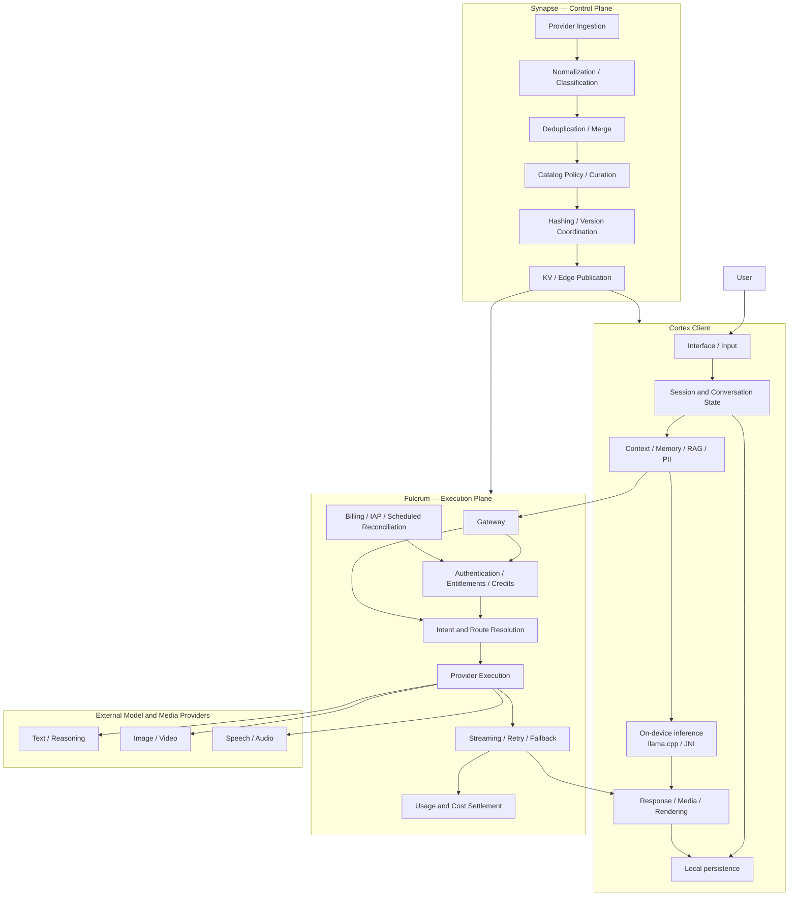
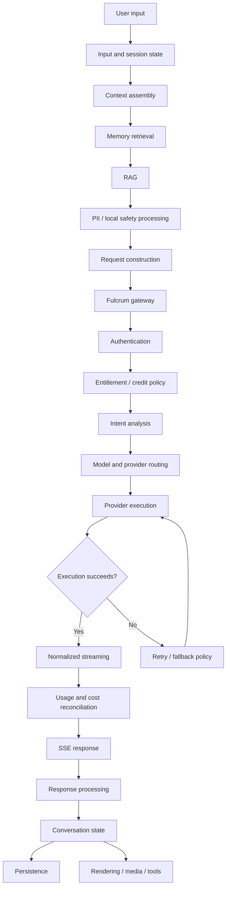
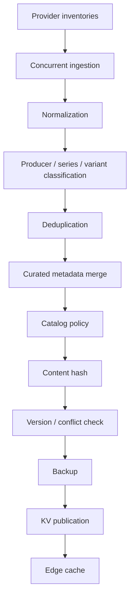
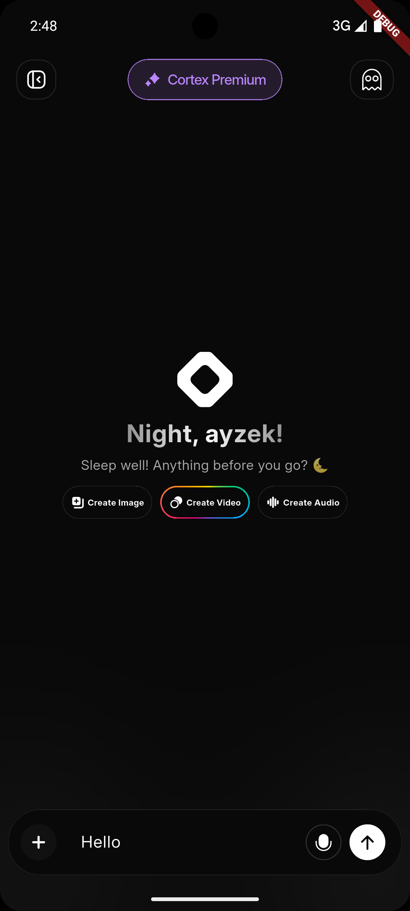
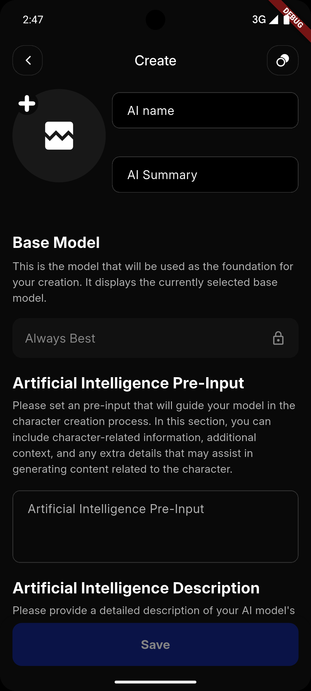
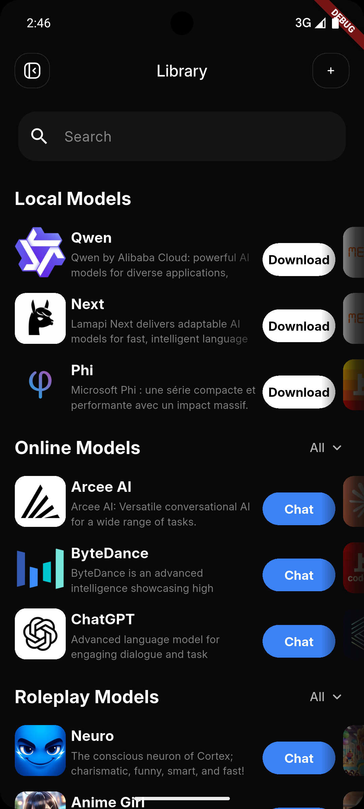
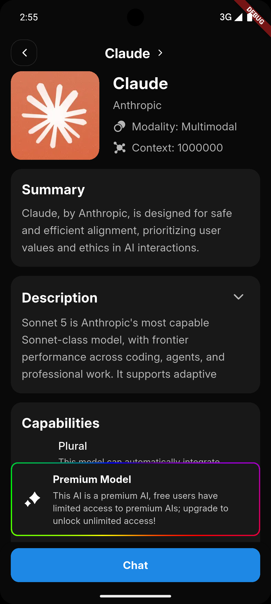
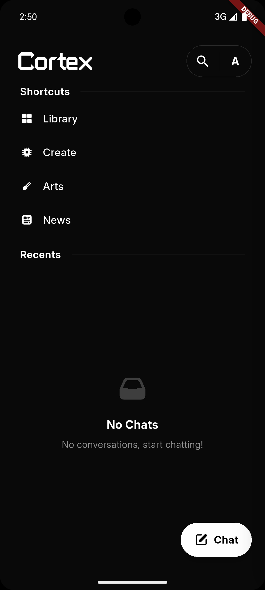
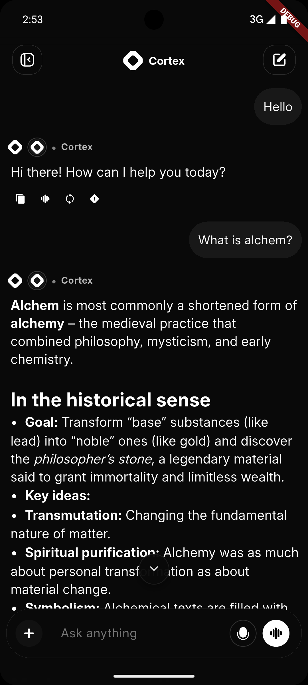

# Cortex

**A hybrid AI platform combining on-device inference, multi-provider orchestration, retrieval, memory, and model infrastructure.**

[](./LICENSE)
[](https://github.com/VertexCorporation/Cortex/stargazers)
[](https://github.com/VertexCorporation/Cortex/commits/main)

[Architecture](./architecture/general.md) ·
[Generation](./architecture/fulcrum/generation.md) ·
[Control Plane](./architecture/synapse/overview.md) ·
[Client Runtime](./architecture/cortex/chat.md) ·
[Source Map](./architecture/cortex/file-map.md)

---

## Overview

Cortex is not a thin client around a single model API.

It is a multi-layer AI system that combines a cross-platform client runtime, local inference, retrieval and memory, a trusted cloud execution plane, provider routing, streaming, commercial authorization, and a separate model-control plane.

The system is divided into three primary architectural domains:

| System | Role | Responsibilities |
|---|---|---|
| **Cortex** | Client runtime | UI state, conversations, local persistence, context assembly, RAG, memory, PII handling, offline inference, media and rendering |
| **Fulcrum** | Execution plane | Authentication, authorization, routing, provider execution, SSE streaming, fallback, usage settlement, entitlements, tools, media and voice |
| **Synapse** | Control plane | Provider ingestion, normalization, deduplication, metadata policy, curation, versioning, distributed coordination and catalog publication |

The boundary is intentional: Cortex owns user experience and local state, Fulcrum owns trusted execution and commercial policy, and Synapse owns model knowledge and publication.

### Production context

Cortex is not an architecture exercise detached from a product.

It runs behind a live consumer platform that has reached users in more than 190 countries and serves tens of thousands of active users.

That means the architecture has to operate across real mobile devices, unreliable networks, third-party provider failures, purchase lifecycles, catalog drift, local model constraints and continuously changing upstream AI services.

### Engineering scope

| Domain | Representative concerns |
|---|---|
| **Hybrid inference** | Local and remote execution under one conversation model |
| **Native runtime** | `llama.cpp`, JNI / NDK integration, GGUF execution and device constraints |
| **Inference orchestration** | Intent analysis, capability matching, routing, retry, fallback and normalized streaming |
| **Model control plane** | Multi-source ingestion, normalization, deduplication, curation, policy, versioning and publication |
| **Commercial state** | Entitlements, credits, IAP verification, idempotent lifecycle handling and reconciliation |
| **Client intelligence** | Context, memory, retrieval, local safety, persistence, media and response-state coordination |
| **Reliability** | Circuit breaking, partial upstream failure, cache invalidation, conflict handling, backups and cleanup |

---

## System Architecture



For the detailed system map, start with [`architecture/general.md`](./architecture/general.md).

---

## Generation Lifecycle

A single online generation crosses multiple independent concerns before a response reaches the screen.



The important property is not the number of stages. Each stage owns a distinct responsibility and failure surface.

A provider timeout, a stale catalog entry, an entitlement mismatch, a dropped SSE connection, a fallback transition and a local persistence failure are different problems handled by different layers.

---

## Cortex Client Runtime

The public Cortex repository contains the user-facing runtime and the orchestration required to combine local and remote AI execution in one product.

### Conversation orchestration

The chat path coordinates responsibilities including:

- input and session state
- conversation state
- context assembly
- semantic memory
- prompt compression
- retrieval
- local PII processing
- moderation
- streaming response processing
- media routing
- persistence
- background behavior
- metrics and limits

The client is intentionally more than a renderer. It prepares and maintains the state required for both local and remote inference.

See [`architecture/cortex/chat.md`](./architecture/cortex/chat.md).

### On-device inference

Cortex supports local model execution through `llama.cpp`, integrated into the mobile runtime through native bindings.

This path allows supported models to execute without sending the conversation to a remote inference provider.

The local stack includes:

- GGUF model execution
- native C/C++ integration
- Android NDK / JNI integration
- sampling configuration
- local inference lifecycle management
- offline moderation paths
- local conversation and model state

The `llama.cpp` source is maintained as a Git submodule under the repository's vendor tree.

### Retrieval and memory

Cortex includes a local retrieval pipeline for bringing user-provided information into model context.

The current architecture separates:

```text
Input
  -> extraction
  -> chunking
  -> local indexing
  -> retrieval
  -> context injection
```

The retrieval interface is designed so the ranking implementation can evolve independently from the rest of the chat pipeline.

See [`architecture/cortex/rag.md`](./architecture/cortex/rag.md).

### Source map

The client architecture is catalogued separately so contributors can locate responsibilities without reverse-engineering the entire `lib/` tree.

See [`architecture/cortex/file-map.md`](./architecture/cortex/file-map.md).

---

## Fulcrum

Fulcrum is the trusted execution plane behind Cortex.

The client may express intent, context and user choices. Fulcrum remains authoritative for operations that cannot safely depend on client state, including provider access, routing policy, commercial authorization and final usage settlement.

### Gateway

The gateway coordinates the request boundary:

```text
request
  -> validation
  -> authentication
  -> feature authorization
  -> credit policy
  -> context / attachment handling
  -> route resolution
  -> provider execution
  -> normalized stream
  -> cost settlement
```

### Dynamic routing

Routing is capability-aware rather than tied to a single provider.

The routing layer can reason about:

- requested task
- model capabilities
- provider availability
- media compatibility
- context constraints
- dynamic model selection
- fallback ordering

This allows execution policy to change without requiring the client to understand provider-specific implementation details.

### Provider execution

Provider-specific behavior is normalized behind the execution layer.

Depending on task and availability, the platform can interact with multiple text, media, speech and transcription providers while exposing a consistent contract to the client.

### Streaming and failure handling

Generation is streamed through Server-Sent Events.

The stream layer is responsible for execution concerns including:

- provider adapters
- incremental output
- retry decisions
- fallback transitions
- provider-specific response parsing
- normalized event delivery
- usage accounting
- final cost reconciliation

A failed provider request and a failed client connection are not treated as the same failure.

### Billing and entitlements

Commercial state is handled on the trusted side of the system rather than delegated to the client.

The billing architecture covers:

- Apple and Google purchase verification
- subscription lifecycle handling
- entitlement state
- credit grants and consumption
- idempotent webhook processing
- scheduled reconciliation
- expiry and cleanup jobs
- refund and abuse-related maintenance paths

See:

- [`architecture/fulcrum/generation.md`](./architecture/fulcrum/generation.md)
- [`architecture/fulcrum/billing.md`](./architecture/fulcrum/billing.md)
- [`architecture/fulcrum/functions-map.md`](./architecture/fulcrum/functions-map.md)

---

## Synapse

Synapse is Cortex's model control plane.

Its job is not to execute user generations. Its job is to maintain the model knowledge that the rest of the platform can trust.

The architecture is split into three primary responsibilities:

| Worker | Responsibility |
|---|---|
| **Syncer** | Automated provider ingestion and deterministic catalog generation |
| **Curator** | Human-authenticated editorial changes |
| **Supervisor** | Enrichment, cleanup and maintenance workloads |

### Catalog pipeline



The ingestion path is designed for partial provider failure: one upstream source should not invalidate the entire catalog.

### Coordination and publication

Synapse uses multiple mechanisms to protect catalog integrity:

- distributed locks
- optimistic version checks
- content hashing
- backups
- explicit cache invalidation
- provider precedence
- deterministic normalization
- curated metadata preservation

Automated synchronization is separated from human curation so machine-generated refreshes do not silently overwrite editorial metadata.

See:

- [`architecture/synapse/overview.md`](./architecture/synapse/overview.md)
- [`architecture/synapse/syncer.md`](./architecture/synapse/syncer.md)
- [`architecture/synapse/curator.md`](./architecture/synapse/curator.md)
- [`architecture/synapse/supervisor.md`](./architecture/synapse/supervisor.md)

---

## Execution Boundaries

Cortex intentionally separates client, execution and control responsibilities.

```text
Cortex
  owns user experience, local state and on-device intelligence

Fulcrum
  owns trusted execution, authorization, routing and settlement

Synapse
  owns model knowledge, normalization, policy and publication
```

This separation keeps several invariants explicit:

1. The client does not become the source of truth for paid entitlements.
2. Provider credentials and privileged routing decisions remain server-side.
3. A model catalog update is independent from the generation request path.
4. Automated catalog ingestion cannot freely overwrite human curation.
5. Provider-specific streaming formats do not leak into client state.
6. Local inference can continue to exist independently from cloud execution.

---

## Failure Surfaces

The architecture is designed around the fact that AI systems fail in more ways than ordinary request-response applications.

| Failure | Owning layer |
|---|---|
| Upstream provider unavailable | Fulcrum routing / streaming |
| Provider fails during a generation | Fulcrum fallback policy |
| Usage differs after fallback | Fulcrum cost reconciliation |
| Client disconnects during SSE | Streaming / client state |
| Purchase webhook is retried | Billing idempotency |
| Subscription state becomes stale | Billing reconciliation |
| Provider catalog source is unavailable | Synapse ingestion |
| Two catalog writers overlap | Synapse coordination |
| Automated sync conflicts with manual metadata | Synapse merge policy |
| Device is offline | Cortex local runtime |
| Remote inference is unavailable | Cortex offline path, when supported |
| Local retrieval has no useful context | Cortex retrieval pipeline |

The goal is not to remove every failure. It is to make ownership of each failure explicit.

---

## Model and Provider Ecosystem

Cortex is designed around provider heterogeneity rather than a single upstream API.

The wider platform integrates capabilities across text inference, media generation, speech, transcription and model metadata.

Provider integration is independent from the ecosystem support relationships listed later in this document.

Examples include:

- OpenRouter
- Cloudflare Workers AI
- Groq
- fal
- ElevenLabs
- Deepgram
- AssemblyAI

Provider support is capability-dependent and may change independently of the client release cycle through the model control plane.

---

## Incubation and Ecosystem Support

### Incubated by

**Cube Incubation — Teknopark Istanbul**

Cortex is incubated at Cube Incubation, the incubation center of Teknopark Istanbul.

The incubation relationship is separate from the infrastructure and tooling support listed below.

### Supported by

Cortex have received infrastructure credits, developer tooling, startup-program access, platform access or other ecosystem support from companies including:

<div align="center">

<a href="https://www.cloudflare.com/"></a>
<a href="https://elevenlabs.io/"></a>
<a href="https://deepgram.com/"></a>
<a href="https://miro.com/"></a>
<a href="https://www.assemblyai.com/"></a>
<a href="https://www.daytona.io/"></a>
<a href="https://about.gitlab.com/"></a>
<a href="https://fal.ai/"></a>

</div>

<sub>Support relationships differ by company and may include credits, startup programs, tooling, infrastructure or platform access. Inclusion here does not imply product endorsement, investment or a commercial partnership unless separately stated.</sub>

---

## Product

Architecture is only useful if it survives contact with a real product.

Cortex exposes the underlying platform through a mobile interface built around conversations, multimodal creation, model selection, local execution and a persistent personal AI environment.

<div align="center">

| | | |
|:---:|:---:|:---:|
|  |  |  |
| **Chat** | **Create** | **Library** |
|  |  |  |
| **Models** | **Navigation** | **Conversation** |

</div>

### Online and offline execution

Cortex supports two execution domains.

**On-device**

Supported local models run through `llama.cpp`. Model execution and the associated conversation path can remain on the device.

**Cloud**

Remote tasks are sent through Cortex's trusted backend and routed to the appropriate execution provider according to task, capability, availability and policy.

These paths share a product surface but have different privacy, availability and performance characteristics.

---

## Repository Structure

```text
Cortex/
├── architecture/          System architecture and responsibility maps
│   ├── general.md
│   ├── cortex/
│   ├── fulcrum/
│   └── synapse/
├── android/               Android host, native integration and build configuration
├── ios/                   iOS host and platform configuration
├── assets/                Models, images, screenshots and application assets
├── lib/                   Flutter / Dart client runtime
├── scripts/               Development and localization tooling
├── test/                  Client tests
├── vendor/                Native and vendored components, including llama.cpp
├── web/                   Flutter web host
├── pubspec.yaml
└── README.md
```

The architecture documentation is the best entry point for understanding the codebase.

---

## Architecture Index

| Document | Scope |
|---|---|
| [`architecture/general.md`](./architecture/general.md) | System boundaries and top-level architecture |
| [`architecture/cortex/chat.md`](./architecture/cortex/chat.md) | Conversation, streaming and client orchestration |
| [`architecture/cortex/rag.md`](./architecture/cortex/rag.md) | Retrieval pipeline |
| [`architecture/cortex/file-map.md`](./architecture/cortex/file-map.md) | Client source responsibility map |
| [`architecture/fulcrum/generation.md`](./architecture/fulcrum/generation.md) | Gateway, routing, streaming and provider execution |
| [`architecture/fulcrum/billing.md`](./architecture/fulcrum/billing.md) | Entitlements, purchases, credits and reconciliation |
| [`architecture/fulcrum/functions-map.md`](./architecture/fulcrum/functions-map.md) | Fulcrum function map |
| [`architecture/synapse/overview.md`](./architecture/synapse/overview.md) | Synapse control-plane overview |
| [`architecture/synapse/syncer.md`](./architecture/synapse/syncer.md) | Automated catalog synchronization |
| [`architecture/synapse/curator.md`](./architecture/synapse/curator.md) | Human curation path |
| [`architecture/synapse/supervisor.md`](./architecture/synapse/supervisor.md) | Enrichment and maintenance |

---

## Current Architecture and R&D Direction

The repository architecture is the source of truth for behavior implemented today.

Vertex also maintains a broader R&D program around Cortex. That work explores deeper hardware-aware local inference, richer multimodal orchestration, expanded platform support, autonomous agents and increasingly expressive model metadata.

This distinction matters because research documents may describe work that is experimental, in progress or planned.

For example, the current Cortex retrieval architecture documents a local BM25-based retrieval path behind a replaceable retrieval interface. Vector and embedding-based retrieval are therefore treated as an evolution path rather than implied here as a current production dependency.

Current engineering and R&D areas include:

- improving on-device inference efficiency across constrained mobile hardware
- hardware-aware native execution and compilation paths
- extending Cortex beyond mobile while preserving local inference
- richer cross-modal generation pipelines
- autonomous multi-step agent execution
- stronger provider and model metadata standardization
- continued separation of automated ingestion, human curation and maintenance workloads
- reducing client/server/catalog contract drift through explicit versioned boundaries

The goal is to deepen the platform without collapsing these responsibilities back into a monolithic request path.

---

## Technology Stack

| Layer | Technologies |
|---|---|
| Client | Flutter, Dart |
| Native AI | C, C++, `llama.cpp`, JNI / Android NDK |
| Backend runtime | Node.js |
| Cloud and edge | Google Cloud, Cloudflare |
| Authentication and data | Firebase |
| Streaming | Server-Sent Events |
| Local retrieval | Local indexing and BM25-based retrieval |
| Model control plane | Cloudflare Workers / KV-based publication architecture |
| Localization | Flutter localization / ARB |

External AI providers are intentionally abstracted behind platform contracts and may evolve over time.

---

## Getting Started

Cortex is not a clone-and-run example application.

The public client depends on native components, Firebase configuration, Cortex backend services and provider infrastructure. A local build can be created, but reproducing the complete production environment requires replacing or configuring the services the client expects.

### Requirements

- Flutter `3.32.7` or newer
- Dart `3.8.1` or newer
- Java JDK 11
- Android Studio
- Android NDK `26.1.1090125`
- Git

### Clone

```bash
git clone https://github.com/VertexCorporation/Cortex.git
cd Cortex
git submodule update --init --recursive
flutter pub get
```

### Firebase

Create a Firebase project and configure the services used by your build.

For Android, place your own:

```text
google-services.json
```

under:

```text
android/app/
```

Do not commit credentials, signing keys, production configuration or private API keys.

### Run

```bash
flutter run
```

The Android build is configured to compile the native `llama.cpp` integration through the NDK.

### Backend configuration

A fully functional independent deployment requires your own compatible backend and provider credentials.

Do not place provider secrets in the Flutter client.

The production Cortex backend is responsible for privileged operations such as authentication-sensitive actions, provider access, routing, billing and commercial policy.

---

## Development Notes

Before making a cross-cutting change, identify the owning subsystem first.

```text
UI or local state issue
  -> Cortex architecture

generation / provider / fallback issue
  -> Fulcrum generation path

purchase / entitlement / credit issue
  -> Fulcrum billing path

model metadata / series / availability issue
  -> Synapse control plane
```

Changes that modify shared contracts should be reviewed across every consumer of that contract.

High-risk examples include:

- SSE event shape
- model catalog schema
- entitlement state
- credit policy
- provider capability metadata
- local database schema
- native inference lifecycle

---

## Contributing

Contributions are welcome.

Before submitting a large change:

1. Read [`architecture/general.md`](./architecture/general.md).
2. Locate the subsystem that owns the behavior.
3. Keep provider-specific logic behind the relevant abstraction boundary.
4. Avoid introducing secrets or production credentials.
5. Add or update tests for behavior that changes.
6. Update architecture documentation when a system boundary or contract changes.

For bugs and feature proposals, use [GitHub Issues](https://github.com/VertexCorporation/Cortex/issues).

---

## Security and Privacy

Cortex has different privacy properties depending on execution mode.

For supported offline models, inference can run locally on the device.

Cloud execution necessarily transmits the information required for the requested operation to remote infrastructure and, where applicable, external AI providers.

Do not assume an online request has the same privacy boundary as an offline request.

See:

- [Privacy Policy](./PRIVACY_POLICY.md)
- [Terms of Service](./TERMS_OF_SERVICE.md)
- [Attributions](https://vertexishere.com/cortex-attributions)

Security issues should not be disclosed through public issue threads when doing so would expose users or infrastructure.

---

## License

Cortex is released under the Apache License 2.0.

See [`LICENSE`](./LICENSE).

---

## About Vertex

Cortex is developed by **Vertex**, a technology company operating from Istanbul and London and incubated at **Cube Incubation, Teknopark Istanbul**.

The project began as an attempt to make advanced AI accessible through a single personal interface and has evolved into a broader hybrid AI platform spanning local execution, cloud orchestration and model infrastructure.

Vertex's R&D work around Cortex focuses on hybrid AI orchestration, on-device inference, model infrastructure, reliability and reducing technical complexity at the product boundary.

[Website](https://vertexishere.com) ·
[GitHub](https://github.com/VertexCorporation) ·
[Support](https://github.com/sponsors/VertexCorporation) ·
[Contact](mailto:contact@vertexishere.com)

<br>

<div align="center">
<i>"Hiç bir şeye ihtiyacımız yok, yalnız bir şeye ihtiyacımız vardır: Çalışkan Olmak."</i><br>
<b>— Mustafa Kemal Atatürk</b>
</div>
