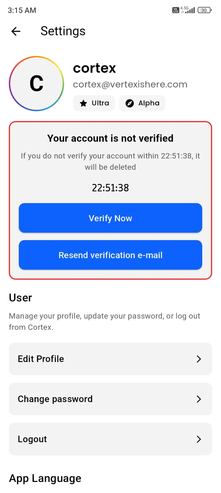
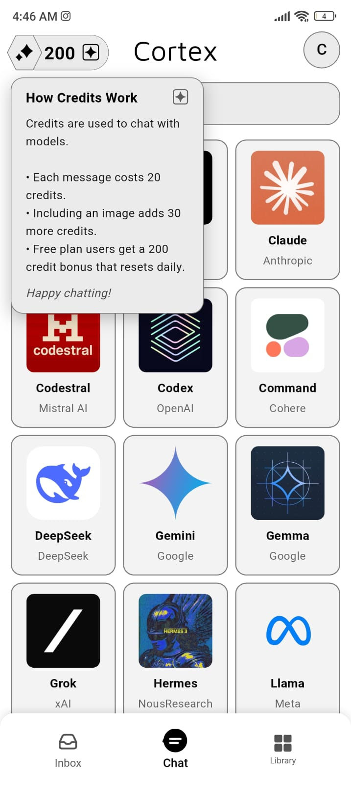
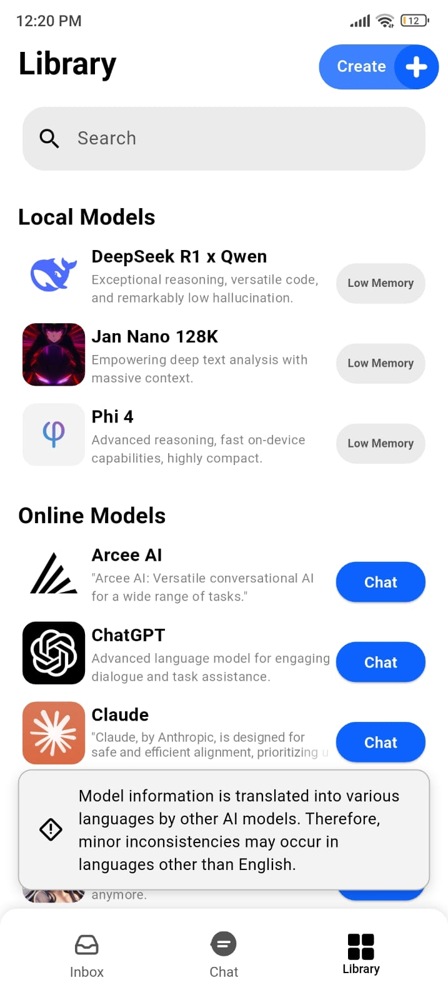
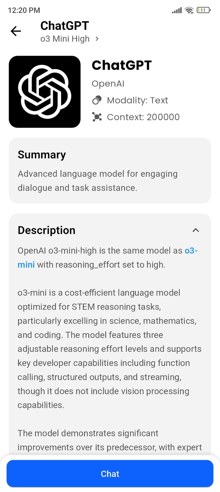

"Bütün ümidim gençliktir."
— Mustafa Kemal Atatürk

Welcome to Cortex

Cortex redefines your relationship with artificial intelligence. It is a
revolutionary mobile application that places the power of cutting-edge AI
directly into your hands, meticulously designed with three core corporate
principles: Privacy, Personalization, and Performance. Whether you are operating
offline in a remote location or seamlessly connected to the cloud, Cortex
ensures your AI companion remains continually accessible and responsive.

Take control of your data, customize your user experience, and access the
pinnacle of artificial intelligence from anywhere in the world.

 App Showcase

|                                                     |                                                     |                                                     |                                                     |
| :-------------------------------------------------: | :-------------------------------------------------: | :-------------------------------------------------: | :-------------------------------------------------: |
|  |  |  |  |
| **Screenshot 1**                                    | **Screenshot 2**                                    | **Screenshot 3**                                    | **Screenshot 4**                                    |
|  |  |  |  |
| **Screenshot 5**                                    | **Screenshot 6**                                    | **Screenshot 7**                                    | **Screenshot 8**                                    |

Table of Contents

  - Why Choose Cortex?
  - Key Features
  - How It Works
      - Offline Mode: The Privacy Fortress
      - Online Mode: The Power of the Cloud
  - Subscription Tiers
  - The Vision & Roadmap
  - A Note on Perseverance
  - Technologies Used
  - Contributing
  - License
  - Legal & Attributions
  - Stay Updated

 Why Choose Cortex?

  -  AI, Anywhere: Utilize powerful artificial intelligence with or without an
    active internet connection, ensuring true operational portability.
  -  Privacy-First by Design: Your data remains strictly yours. With our
    dedicated offline mode, your conversations and queries never leave your
    device hardware.
  -  Unmatched Personalization: From advanced visual themes to the deployment of
    your custom AI models, configure Cortex to reflect your unique professional
    requirements.
  -  Open Source & Transparent: Founded on trust, reliability, and community
    contribution. Our foundational code is fully accessible on GitHub for
    rigorous review.
  -  Sleek & Modern Interface: Enterprise-grade functionalities elegantly
    wrapped in an intuitive, high-performance package engineered with Flutter.

 Key Features

  - Dual Infrastructure Modes:

      - Offline AI (Llama.cpp): Execute language models natively on your device
        hardware. 100% private and decentralized; no internet connectivity is
        required.
      - Online AI (Cloud-Powered): Connect seamlessly to state-of-the-art models
        such as GPT-4o and Amazon Nova via our highly secure, distributed server
        infrastructure.

  -  Your Personal AI Laboratory:

      - Create & Deploy Models: Architect your own bespoke AI assistant from the
        ground up or import an existing GGUF format model. Establish specific
        characters or expert advisory personas with absolute control—no deep
        technical expertise necessary.
      - Automated Compliance & Safety: To safeguard our global community, all
        user-generated and uploaded models undergo stringent automated reviews
        against our comprehensive content and safety policies.

  -  True Customization:

      - Extend beyond standard light and dark configurations. Personalize your
        user interface employing a premium library of themes, delivering an
        aesthetic workflow that aligns with your brand or preference.

  -  Interactive AI Personas:

      - Collaborate with a curated roster of specialized AI characters, each
        engineered with a distinct operational purpose. Receive specialized
        consultations from legal simulators, educational mentors, or engage with
        versatile creative personas.

 How It Works

Cortex seamlessly integrates two distinct operational modes to optimize the
balance between uncompromising privacy and immense computational power.

 Offline Mode: The Privacy Fortress

  - Core Engine: Driven by a highly optimized Llama.cpp engine, meticulously
    integrated via JNI (Java Native Interface).
  - Data Flow: All computational processing occurs 100% locally. Prompts and
    AI-generated responses never transmit past your physical device hardware,
    ensuring absolute data sovereignty.
  - Safety Protocol: To maintain a compliant operational environment, the
    application periodically syncs an updated repository of moderation protocols
    from Google Firebase (when an active connection is detected). The safety
    verification is executed locally on your device without transmitting
    confidential conversation data.

 Online Mode: The Power of the Cloud

  - Enterprise Gateway: In this configuration, prompts are transmitted to
    premium, cloud-based AI models via OpenRouter, a robust third-party API
    gateway infrastructure.
  - Data Flow & Compliance:
    1.  Your prompt is initially evaluated by enterprise partners (e.g., OpenAI)
        via an automated compliance review.
    2.  Upon successful verification, the data is securely relayed through our
        Cloudflare-protected infrastructure to OpenRouter, which efficiently
        routes the request to your designated AI provider (e.g., Anthropic,
        Google).
  - Privacy Disclosure: This operational mode is inherently less
    privacy-isolated, as query data is transmitted to remote servers. Vertex
    Corporation operates strictly as a secure relay and does not persistently
    log or store your conversation content. We advise all corporate users to
    review the corresponding privacy agreements of our partner providers.

 Subscription Tiers

Cortex provides flexible access tiers designed to accommodate everyone from
individual enthusiasts to power users.

  -  Free Tier:

      - Access foundational online models subject to daily operational limits.
        An ideal entry point for evaluation and testing.

  -  Plus, Pro, & Ultra Tiers:

      - Unlock the uncompromising capabilities of Cortex. Benefit from elevated
        usage quotas, the infrastructure to formulate and host custom models,
        exclusive access to premium themes, and dedicated enhancements. Flexible
        cancellation available at any time.

For current corporate pricing schedules and detailed feature matrices, please
consult the Products module within the Cortex application.

 The Vision & Roadmap

Our overarching corporate mission is to establish Cortex as the definitive
central hub for localized and personal artificial intelligence. We are merely at
the inception of this journey. The upcoming architectural roadmap includes:

  -  Bring Your Own Key (BYOK): Seamlessly integrate customized API keys from
    diverse AI providers to operate independently of the Cortex credit
    infrastructure.
  -  Multi-Modal AI Systems: Transcend standard text generation. Synthesize
    high-fidelity images, voice, and video native to the Cortex environment.
  -  Train from Scratch Framework: Advanced developer tooling allowing
    enterprise users to train entirely novel models directly upon proprietary
    datasets.
  -  Real-Time Interaction Dynamics: Conduct fluid, zero-latency voice and video
    dialogues with your designated AI instances.
  -  Autonomous AI Agents: Deploy sophisticated AI agents capable of
    comprehending complex, multi-stage corporate objectives and executing them
    autonomously.
  -  Cortex for Web Ecosystem: Securely access your personalized AI
    infrastructure from any networked device utilizing a modern web browser.

A Note on Perseverance

The architectural journey to construct Cortex has been a marathon of dedication
and resolve. Initiating this project at merely 15 years of age, our development
team invested profound passion into the source code, repeatedly encountering
formidable industry barriers: over 20 consecutive rejections from major
application platforms, 2 severe account suspensions, and numerous operational
warnings.

Relinquishing the project was never a viable option because we fundamentally
believe in the core vision: an artificial intelligence ecosystem engineered to
serve the individual user, prioritizing autonomy over monetization. Cortex
stands as a corporate testament to resilience. To every developer, engineer, or
visionary confronting systemic setbacks: do not halt your progress. Unyielding
persistence remains your most valuable equity. Keep building the future.

 Tech Stack

  -  Frontend: Flutter, Dart
  -  Backend & Cloud Infrastructure:
      - Runtime Environment: Node.js
      - Hosting & CDN Delivery: Google Cloud, Cloudflare
      - Authentication & Database Operations: Google Firebase
  -  AI Core Architecture:
      - Online API Gateway: OpenRouter
      - Offline Processing Engine: Llama.cpp (C and C++ compiled with robust JNI
        Bindings)
  -  Localization: flutter_localizations (structured utilizing standard ARB
    frameworks)

 Getting Started

Welcome, developers and enterprise engineers. We are enthusiastic about your
interest in analyzing the internal mechanics of the Cortex repository.

Important Note: Cortex is an intricate application architecture tightly
synchronized with custom backend nodes and numerous third-party dependencies.
This repository is not designed as a standard "clone and run" setup. Substantial
configuration and environmental staging are necessary to deploy a local
development instance successfully.

Execute the following operational directives precisely to construct your
personal instance of the Cortex environment.

1. Prerequisites

Verify that the following development tools and exact versions are provisioned
on your local workstation.

  - Flutter SDK: Version 3.32.7 or newer
  - Dart SDK: Version 3.8.1 or newer (included within the standard Flutter
    installation)
  - Java JDK: Specifically Version 11 (JavaVersion.VERSION_11)
  - Android Studio: Highly recommended for optimal management of Android SDKs
    and virtual device emulators.
  - Android NDK: Version 26.1.1090125 is structurally required by this project
    build. You may provision this specific iteration via the Android Studio SDK
    Manager (Tools > SDK Manager > SDK Tools).
  - Git

2. Environment & Service Configuration

Prior to executing the application compilation, you must provision your
independent backend infrastructure. This represents the most critical phase of
deployment.

Step 2.1: Firebase Project Configuration

The application relies heavily upon Google Firebase for secure authentication
protocols, database management, and rule validation.

1.  Navigate to the Firebase Console and initialize a new project workspace.
2.  Enable Authentication (Email/Password), initialize the Firestore Database,
    and activate any parallel services referenced within the source code.
3.  Register a distinct Android application within your active Firebase project
    dashboard.
4.  Complete the documented instructions to export the google-services.json
    manifest. Place this exact file within your local android/app/ repository
    directory.

Step 2.2: OpenRouter API Provisioning

Cloud-based AI models are interfaced directly through OpenRouter.

1.  Proceed to OpenRouter.ai and establish a new account credentials.
2.  Generate your unique API cryptographic key. This specific key must be
    securely embedded into your backend server logic.

Step 2.3:  Crucial Step: Your Independent Backend Server

A vast majority of logic sequences (including user session authentication,
profile mutations, and API key management routing) are processed via our
proprietary backend. You are required to structurally replicate or replace this
corporate logic.

1.  Conduct a rigorous audit of the Flutter codebase to isolate all HTTP request
    paths initiating toward server endpoints.
2.  Architect your own secure backend server environment (leveraging Node.js,
    Python, or your authorized enterprise stack) engineered to resolve these
    exact endpoints.
3.  Your server infrastructure will assume the responsibility of securely
    encrypting and storing localized user data, and proxying verified requests
    to external services like OpenRouter utilizing your proprietary API key.
4.  Systematically update the API endpoint URI strings located within the
    Flutter codebase to direct network traffic toward your newly deployed server
    architecture.

3. Local Project Setup & Build Procedures

You are now prepared to deploy the project framework directly on your local
workstation.

1.  Clone the Repository Securely:

    git clone https://github.com/VertexCorporation/Cortex.git
    cd Cortex

2.  Initialize Essential Submodules (Llama.cpp): Cortex relies upon the
    llama.cpp framework for its localized AI processing engine, embedded as a
    strictly tracked Git submodule. Initialization is mandatory:

    git submodule update --init --recursive

3.  Android Build Configuration:

  - Verify the google-services.json manifest (exported during Step 2.1) is
    located precisely inside the android/app/ directory tree.
  - Construct a Secure Keystore: Cryptographic signing is mandatory for
    development compilation. Consult the official Flutter enterprise
    documentation to create and reference a secure keystore. This process
    requires the generation of a local key.properties file housed in the
    android/ directory; this file should NEVER be committed or exposed to the
    public Git tree.

4.  Install Required Dependencies:

    flutter pub get

5.  Compile and Run: You should now be authorized to compile the application.
    The integrated Android Gradle framework is pre-configured to systematically
    compile the llama.cpp binary engine utilizing the specified NDK version.

    flutter run

4. Automatic Translation Automation Setup (Optional)

This enterprise repository utilizes a semi-automated Python script designed to
translate newly implemented localization keys globally across all officially
supported languages via the Google Translate API network. This remains an
optional yet highly advised deployment step should you intend to contribute
formally to the application's international localization.

Execute these one-time configuration protocols to activate the global translate
function on your local shell environment.

Step 4.1: Automation Prerequisites

  - Python 3 Ecosystem: Ensure you have a standardized, modern release of
    Python 3 successfully installed. Verify the environment by executing python3
    --version.
  - Google Cloud Authorized API Key: You must acquire an active cryptographic
    API Key generated from a verified Google Cloud project possessing the "Cloud
    Translation API" permission set enabled. The project node must maintain an
    active, valid billing account. While the API maintains a comprehensive free
    tier allowance, a verified billing source remains mandatory for network
    activation.

Step 4.2: Install Python API Library

Launch your standard system CLI interface and execute the following package
command to install the required Google Translate library natively for your user
profile.

pip3 install --user google-cloud-translate

Step 4.3: Configure the Terminal translate Command

This customized shell command framework will autonomously manage the translation
matrix.

1.  Access your active shell's localized configuration file (e.g., ~/.bashrc or
    ~/.zshrc).

    # For Bash environments (Standard on most Linux distributions)
    nano ~/.bashrc

    # For Zsh environments (Standard on macOS architectures)
    nano ~/.zshrc

2.  Insert the complete function block detailed below securely at the conclusion
    of the configuration file.

3.  Crucially, replace the "YOUR_GOOGLE_API_KEY_HERE" placeholder with your
    officially authorized API Key string.

    #
    # --- Cortex Enterprise Project: Automated Translation Architecture ---
    #
    function translate() {
        echo "--- Executing Cortex Translation Protocol via Google API v2 ---"
        
        # 1. Navigate precisely to the project root directory.
        #    Modify this exact path if your project is housed in an alternative repository location.
        cd ~/Documents/cortex || { echo "Critical Error: Failed to resolve project directory path."; return 1; }

        # 2. Inject the localized API Key exclusively for the duration of this terminal session.
        export GOOGLE_API_KEY="YOUR_GOOGLE_API_KEY_HERE"
        if [ -z "$GOOGLE_API_KEY" ]; then
            echo "Critical Error: GOOGLE_API_KEY environment variable is null. Please verify your shell configuration file."
            return 1
        fi

        # 3. Execute the primary Dart orchestration script that processes the translation logic tree.
        echo "-> Initiating the master translation orchestration script..."
        dart run scripts/translate.dart
        
        echo "--- Translation Processing Sequence Successfully Completed ---"
    }

4.  Write the changes securely (Ctrl+X, Y, Enter) and immediately reload your
    active terminal session configuration by restarting the terminal client, or
    executing source ~/.bashrc (or source ~/.zshrc).

Step 4.4: Authenticate gCloud Identity (One-Time Command Execution)

To guarantee the API seamlessly records network usage against your specific
project node for accurate billing and quota metrics, you must explicitly declare
your primary "quota project".

1.  Identify your designated Project ID directly from your GCP Console
    Enterprise Dashboard.
2.  Execute the subsequent command string within your terminal, explicitly
    replacing YOUR_PROJECT_ID_HERE with your validated Project ID.
    gcloud auth application-default set-quota-project YOUR_PROJECT_ID_HERE

Operational Execution

Your automated deployment is structurally finalized! To execute translations
upon new string keys:

1.  Insert your latest English linguistic strings directly into the primary
    lib/l10n/app_en.arb database file.
2.  Initialize a New System Terminal Session.
3.  Execute the following simplified command string:
    translate

The orchestration script will autonomously detect newly implemented keys and
process the translations globally.

We acknowledge the complexity inherent in this setup framework; however, upon
successful completion, you will possess a fully validated, independently
operational instance of the Cortex architecture. Happy coding.

 Contributing

Cortex operates profoundly on the ethos of open-source professional
collaboration and is currently deployed in live production! We highly value
formal contributions that assist our enterprise in dictating the future of
personal artificial intelligence frameworks. Review the subsequent operational
procedures to assist us:

  -  Star the main repository to formally express your endorsement of the
    project structure.
  -  File an official issue ticket to document anomalies, propose structural
    feature requests, or inquire regarding operational technicalities.
  -  Fork the enterprise repository and submit a standardized Pull Request
    resolving code defects or implementing authorized new features. Please
    thoroughly audit our official contribution guidelines or establish an issue
    ticket initially to negotiate substantial architectural modifications.
  -  Distribute your professional feedback regarding application stability to
    aid in refining our end-user operational experience.
  -  You may also financially support infrastructure expenses via subscription
    tiers or credit acquisitions, as our production servers require capital
    beyond GitHub repository stars. 

 License

The Cortex software suite is robustly open-source and formally distributed
beneath the parameters of the Apache 2.0 License. Review the embedded LICENSE
document for comprehensive legal parameters.

 Legal & Attributions

Corporate trust and user accountability remain our utmost priorities. We
maintain a firm commitment to systemic transparency detailing our operations and
integrated resources.

  - Privacy Policy - A definitive framework outlining our strict data governance
    and handling procedures.
  - Terms of Service - The official legal parameters managing your integration
    with the Cortex ecosystem.
  - Full Attributions - A comprehensive legal directory itemizing third-party
    assets, interface icons, and respective distribution licenses.

 Stay Updated

Subscribe to updates on the primary repository and navigate to our corporate
domain for the most recent press releases, systemic updates, and substantial
feature rollouts.

vertexishere.com | contact@vertexishere.com

Participate in the technological revolution. Experience the nexus where extreme
personalization converges with absolute artificial intelligence freedom.

Thank you for evaluating the Cortex ecosystem. Together, we are engineering the
future architecture of AI.
